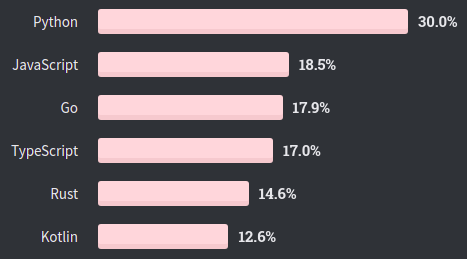
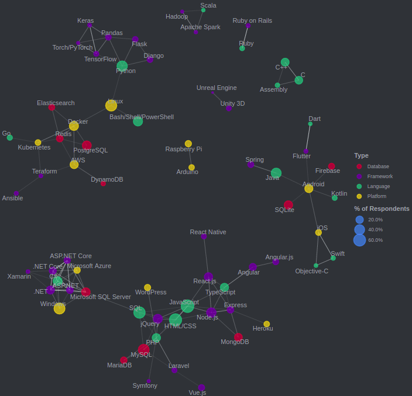
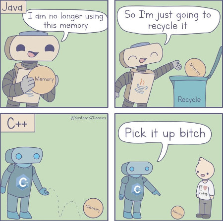
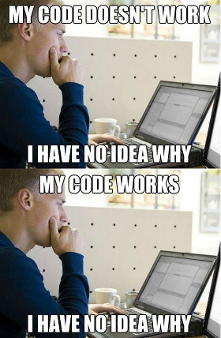
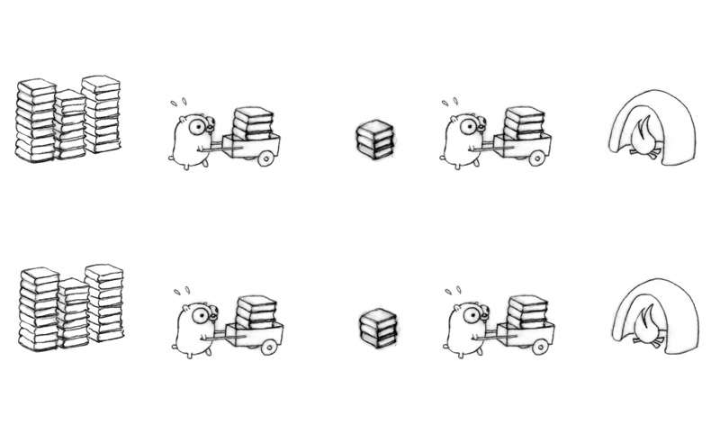
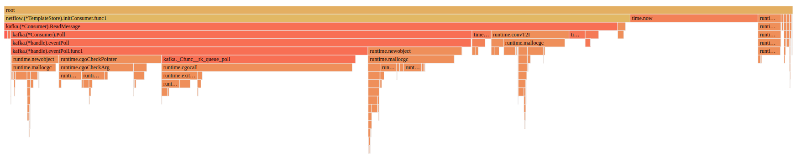
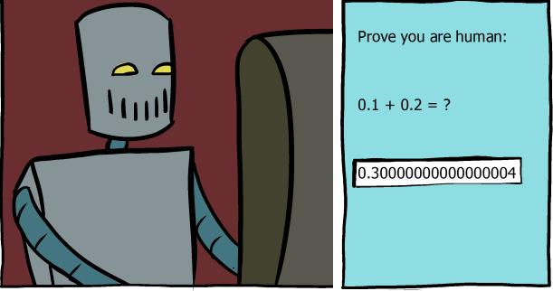
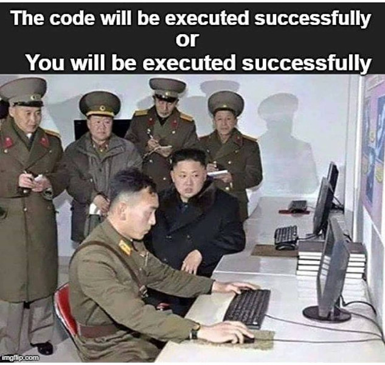
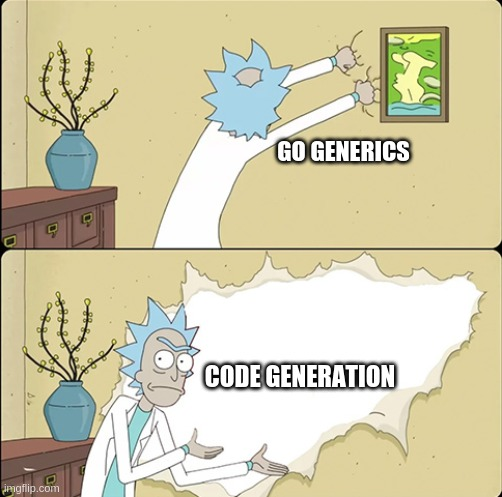

# Tour of Go - Expansion Pack

---
Press `H` to show help.  

October 2020

---
# Stack Overflow Developer Survey 2020

---
## Most Loved Languages

% of developers who are developing with the language or technology and have expressed interest in continuing to develop with it

"We also see big gains in Go, moving up to 5th from 10th last year."

[Source](https://insights.stackoverflow.com/survey/2020#most-loved-dreaded-and-wanted)

---
## Most Wanted Languages

% of developers who are not developing with the language or technology but have expressed interest in developing with it

---
## Top Paying Technologies

Median of 33,534 responses; USD

---
## Correlated Technologies

---
# Golang
- First appeared in 2009
- statically typed
- compiled (compiler written in Go itself)

- garbage-collected
- explicit support for concurrent programming
- open source
- easy to learn, hard to master

---
## Golang: pros (1)
- simplicity, ease of use
- fast (at runtime)
- fast compilation, compiled directly to binary (Go was developed while waiting for a C++ program to compile)
- functional programming support
- goroutines
- channels
- mutliple return values
- deferred statements
- error handling

---
## Golang: pros (2)
- garbage collector (low latency)

---
## Golang: pros (3)
- nice built-in tools: dependency management, go test, benchmarks, code formatter, static code analysis, godoc
- idiomatic approach (e.g. code format)
- rich community libraries
- easy custom packages publishing
- type embedding
- variadic functions
- profiling tools
- potential race condition detection
- tags: easy yaml/json marshal

---
## Golang: cons

- No generic types
- Code duplication: boilerplate code for constructors, simple conversions, collection operations (mapping, filtering, getting keys from map)
- Garbage Collector introduces Stop-the-World (no manual memory management)
- still in development
- Simple operations are complicated (not memorable)
- no optional parameters
- many traps
- implicit interfaces makes refactoring harder
- hardcoded mutability

---

---
# Basics Repetition
---
## Tour of Go

- Tour of Go: [https://tour.golang.org/](https://tour.golang.org/)
- Go Playground: [https://play.golang.org/](https://play.golang.org/)
- [An Introduction to Programming in Go](https://www.golang-book.com/books/intro)

---
## Tour of Go (2)

What's missing in Tour of Go? 

- Go by Example: [https://gobyexample.com/](https://gobyexample.com/)
- Effective Go: [https://golang.org/doc/effective_go.html](https://golang.org/doc/effective_go.html)
- Language Specification: [https://golang.org/ref/spec](https://golang.org/ref/spec)

---
## Concurrency vs Parallelism

---
## Goroutines vs Threads
Goroutines:

- managed by the Go runtime (not by OS kernel)
- not hardware dependent
- typically have 8kB of stack size (threads have fixed 1-2 MB) and can grow up
- easy communication medium (channels) with low latency
- doesn't have ID, doesn't have Thread Local Storage
- very cheap setup & teardown cost (OS is not aware of goroutines)
- cooperatively scheduled (not preemptively), switching cost is low - only 3 registers (50 registers for threads) need to be switched

---
## Goroutines threats
	!go
	go Listen("0.0.0.0:8080")

	var network string
	go func(address string) {
		Listen(network, address)
	}("0.0.0.0:8080")

- unsynchronized access, data race
- losing returned value
- deadlock
- goroutines leak

---
## Share by Communicating
> Don't communicate by sharing memory;  
share memory by communicating

---
## Error handling

Copy-pasting "`if err != nil {`" everywhere in Go

---
## Error handling: wrapping context

	!go
	import (
		"github.com/pkg/errors"
		log "github.com/inconshreveable/log15"
	)

	func doSomething() (*string, error) {
		result, err := getResult()
		if err != nil {
			return nil, errors.Wrap(err, "unable to initialize")
		}
		return result, nil
	}
	...
	log.Error("initialization error", log.Ctx{
		"error": err,
	})
	...
	ERROR[08-21|15:54:09] initialization error   caller=run.go:26 
	error="unable to initialize: Error when configuring server: 
	unable to create authentication component: failed to initialize 
	keystone client: failed to initialize Keystone v3: failed to 
	authenticate gophercloud client: 
	Post \"http://10.0.50.2:5000/v3/auth/tokens\": 
	net/http: request canceled while waiting for connection 
	(Client.Timeout exceeded while awaiting headers)"

---
## Go compiler errors
> The presence of an unused variable may indicate a bug. 
Go refuses to compile programs with unused variables or imports, trading short-term convenience for long-term build speed and program clarity

---
## Godoc (1/2)

	!go
	// Fprint formats using the default formats for its operands 
	// and writes to w.
	// Spaces are added between operands when neither is a string.
	// It returns the number of bytes written and 
	// any write error encountered.
	func Fprint(w io.Writer, a ...interface{}) (n int, err error) {
		...
	}

Generate godocs:

	go get -v golang.org/x/tools/cmd/godoc
	godoc -http=:6060

[http://127.0.0.1:6060](http://127.0.0.1:6060)

---
## Godoc (2/2)
Minimalistic approach:

- Subsequent lines of text are considered part of the same paragraph; you must leave a blank line to separate paragraphs.
- Pre-formatted text must be indented relative to the surrounding comment text
- URLs will be converted to HTML links
- Interface methods & unexported implementation types are not documented (WTF?)
- Can only create a documentation for all go files in GOPATH (workaround: open localhost:6060/pkg/)

Example: `io.Reader`

---
## Strict formatter

	!go
	l := []string{
		"Trailing",
		"comma",
		"is cool",
	}

- Go enforces using trailing commas
- Doesn't require `()` around `if`: `if err == nil {`
- `go fmt` reformats code to tabulated

---
## Slice
Slice is a dynamically-sized, flexible view into the elements of an array. 
Slice consists of:

- pointer to first element in array
- length
- capacity

	!go
	texts := make([]string, 0, 3)

---
# Type assertion vs conversion

---
## Type assertion
For an expression `x` of interface type and a type `T`, the primary expression

	x.(T)

asserts that x is not nil and that the value stored in x is of type T. The notation x.(T) is called a type assertion.

A type assertion used in an assignment or initialization of the special form

	v, ok = x.(T)

yields an additional untyped boolean value. The value of ok is true if the assertion holds. Otherwise it is false and the value of v is the zero value for type T. No run-time panic occurs in this case.

---
## Type conversion
A conversion changes the type of an expression to the type specified by the conversion. A conversion may appear literally in the source, or it may be implied by the context in which an expression appears.

An explicit conversion is an expression of the form T(x) where T is a type and x is an expression that can be converted to type T.

	uint(iota)               // iota value of type uint
	float32(2.718281828)     // 2.718281828 of type float32
	complex128(1)            // 1.0 + 0.0i of type complex128
	float32(0.49999999)      // 0.5 of type float32
	float64(-1e-1000)        // 0.0 of type float64
	string('x')              // "x" of type string
	MyString("foo" + "bar")  // "foobar" of type MyString
	string([]byte{'a'})      // not a constant: []byte{'a'} is not a constant
	(*int)(nil)              // not a constant: nil is not a constant, *int is not a boolean, numeric, or string type
	int(1.2)                 // illegal: 1.2 cannot be represented as an int
	string(65.0)             // illegal: 65.0 is not an integer constant

---
## Non-Blocking Channel Operations

	!go
	channel <- msg

	!go
	select {
    case channel <- msg:
        fmt.Println("sent message", msg)
    default:
        fmt.Println("no message sent")
    }

---
## Type embedding
Go does not provide the typical, type-driven notion of subclassing, but it does have the ability to “borrow” pieces of an implementation by embedding types within a struct or interface.

There's an important way in which embedding differs from subclassing. When we embed a type, the methods of that type become methods of the outer type, but when they are invoked the receiver of the method is the inner type, not the outer one.

	!go
	type ReadWriter interface {
	    Reader
	    Writer
	}

	type ReadWriter struct {
	    *Reader  // *bufio.Reader
	    *Writer  // *bufio.Writer
	}

---
### Type embedding (2)
[type_embedding.go](https://play.golang.org/p/b6kQC8Xf2p8)

	!go
	type Rick struct {
	    morty string
	}

	func (r Rick) whoAmI() {
	    fmt.Println("Rick Sanchez")
	}

	type PickleRick struct {
	    Rick
	    pickles int
	}

	func (r PickleRick) whoAmI() {
	    fmt.Println("I'm a pickle!")
	}

    rick := PickleRick{Rick: Rick{morty: "evil Morty"}, pickles: 1}
    fmt.Println(rick)
    fmt.Println(rick.morty, rick.Rick.morty)
    rick.whoAmI()
    rick.Rick.whoAmI()

---
### Type embedding vs inheritance
> "Prefer composition over inheritance"

Type embedding in Go disguises composition as inheritance.

Inheritance usually gives us:

- Extending - borrowing implementation from another class
- Polymorphism - can be achieved in Go using Interfaces
- Ovverriding - supported in Go, but not quite like in OOP languages ([no_parent_method_override.go](https://play.golang.org/p/5CSTEM5TAFG))

---
## Type aliases
structs, interfaces are just type aliases ([type_alias.go](https://play.golang.org/p/OoZcBnfsj0V)):

	!go
	// type alias
	type bignumber int64
	// struct
	type Empty struct{}
	type Address struct{host string}
	type Address2 struct{
		host string
	}
	// interface
	type I interface{}
	type I2 interface{
		match(input string) bool
	}
	// func
	type Matcher func(input string) bool
	type Matcher2 func(input struct{host string}) bool

---
# Evolution of a Go Programmer

[The Evolution of a Go Programmer](https://github.com/SuperPaintman/the-evolution-of-a-go-programmer)

---
### Evolution of a Go Programmer
Junior Go programmer

	!go
	package fac

	func Factorial(n int) int {
		res := 1

		for i := 1; i <= n; i++ {
			res *= i
		}

		return res
	}

---
### Evolution of a Go Programmer
Functional Go programmer

	!go
	package fac

	func Factorial(n int) int {
		if n == 0 {
			return 1
		} else {
			return Factorial(n - 1) * n
		}
	}

---
### Evolution of a Go Programmer
Generic Go programmer

	!go
	package fac

	func Factorial(n interface{}) interface{} {
		v, valid := n.(int)
		if !valid {
			return 0
		}

		res := 1

		for i := 1; i <= v; i++ {
			res *= i
		}

		return res
	}

---
### Evolution of a Go Programmer
Multithread optimized Go programmer

	!go
	package fac

	import "sync"

	func Factorial(n int) int {
		var (
			left, right = 1, 1
			wg sync.WaitGroup
		)

		wg.Add(2)

		pivot := n / 2

		go func() {
			for i := 1; i < pivot; i++ {
				left *= i
			}

			wg.Done()
		}()

		go func() {
			for i := pivot; i <= n; i++ {
				right *= i
			}

			wg.Done()
		}()

		wg.Wait()

		return left * right
	}

---
### Evolution of a Go Programmer
Discovered Go patterns

	!go
	package fac

	func Factorial(n int) <-chan int {
		ch := make(chan int)

		go func() {
			prev := 1

			for i := 1; i <= n; i++ {
				v := prev * i

				ch <- v

				prev = v
			}

			close(ch)
		}()

		return ch
	}

---
### Evolution of a Go Programmer
Fix Go weaknesses with mature solutions

	!go
	package fac

	/**
	 * @see https://en.wikipedia.org/wiki/Factorial
	 */
	type IFactorial interface {
		CalculateFactorial() int
	}

	// FactorialImpl implements IFactorial.
	var _ IFactorial = (*FactorialImpl)(nil)

	/**
	 * Used to find factorial of the n.
	 */
	type FactorialImpl struct {
		/**
		 * The n.
		 */
		n int
	}

	/**
	 * Constructor of the FactorialImpl.
	 *
	 * @param n the n.
	 */
	func NewFactorial(n int) *FactorialImpl {
		return &FactorialImpl{
			n: n,
		}
	}

	/**
	 * Gets the n to use in factorial function.
	 *
	 * @return int.
	 */
	func (this *FactorialImpl) GetN() int {
		return this.n
	}

	/**
	 * Sets the n to use in factorial function.
	 *
	 * @param n the n.
	 * @return void.
	 */
	func (this *FactorialImpl) SetN(n int) {
		this.n = n
	}

	/**
	 * Returns factorial of the n.
	 *
	 * @todo remove "if" statement.
	 * @todo Maybe we should use a factory or somthing?
	 *
	 * @return int.
	 */
	func (this *FactorialImpl) CalculateFactorial() int {
		if this.n == 0 {
			return 1
		}

		n := this.n
		this.n = this.n - 1

		return this.CalculateFactorial() * n
	}

---
### Evolution of a Go Programmer
Senior Go programmer

	!go
	package fac

	// Factorial returns n!.
	func Factorial(n int) int {
		res := 1

		for i := 1; i <= n; i++ {
			res *= i
		}

		return res
	}

---
### Evolution of a Go Programmer
Rob Pike

	package fac

	// Factorial returns n!.
	func Factorial(n int) int {
		res := 1

		for i := 1; i <= n; i++ {
			res *= i
		}

		return res
	}

---
# Tricks
---
## Composite map key
	!go
	type FlowGroupingKey struct {
		SrcIp                string
		DstIp                string
		Proto                uint32
		SrcPort              uint32
		DstPort              uint32
		Vni                  uint32
		SrcIf                uint32
		DstIf                uint32
		IsFirstDeviceOnRoute bool
		IsLastDeviceOnRoute  bool
		OverlaySrcIp         string
		OverlayDstIp         string
		OverlaySrcPort       uint32
		OverlayDstPort       uint32
		OverlayProto         uint32
	}

	batch map[FlowGroupingKey]*Flow

- comparison operators must be fully defined for key type
- slice types not allowed

---
## pprof CPU profiling
1. Start CPU profiler ([profileme.go](https://play.golang.org/p/zZ5wG2vS3hf)). Gather data...

		!go
		cpuProfile, _ := os.Create("cpuprof.prof")
		pprof.StartCPUProfile(cpuProfile)
		defer pprof.StopCPUProfile()

2. Open pprof server. View flamegraph on http://localhost:8080:  

		!bash
		go tool pprof -http=:8080 cpuprof.prof

---
## Enum

	!go
	type Stereotype int

	const (
	    TypicalNoob Stereotype = iota // 0
	    TypicalHipster                // 1
	    TypicalUnixWizard             // 2
	    TypicalStartupFounder         // 3
	)

---
## caching modules in docker

Quicker rebuilds on changes in source code only

	!dockerfile
	# 1. download dependencies
	COPY component/go.mod /tmp/mods/
	WORKDIR /tmp/mods
	RUN go mod download

	# 2. build project
	COPY component /src/component/
	WORKDIR /src/component
	RUN go get ./...

- Profitable for frequent code changes with the same dependencies.
- more docker layers

---
# go test

---
# go test files

- test files ends with `_test.go`
- located in the same package (folder) as source code
- contains `Test*** functions`

---
## test flags: Data Race Detector
[race_test.go](https://play.golang.org/p/9XYPvBLdaOk)

`go test -race race_test.go`  
enables Data Race Detector (records when and how the memory was accessed, watches for unsynchronized accesses to shared variables)

	!go
	func main() {
		c := make(chan bool)
		m := make(map[string]string)
		go func() {
			m["1"] = "a" // First conflicting access.
			c <- true
		}()
		m["2"] = "b" // Second conflicting access.
		<-c
		for k, v := range m {
			fmt.Println(k, v)
		}
	}

---
## Ginkgo (1)
Assert float equality

	!go
	Expect(1.0).Should(BeNumerically("~", 0.999, 0.01))

---
# Ginkgo (2)

	!go
	var _ = Describe("config exposer tests", func() {
		BeforeEach(func() {
			...
		})
		AfterEach(func() {
			...
		})

		It("should expose config", func() {
			...
		})

		Specify("should expose config", func() {
			...
		})

		FSpecify("should expose config", func() {
			...
		})
	})

---
## Ginkgo (3)
	!go
	It("should expose config", func() {
		err := doSomething()
		Expect(err).NotTo(HaveOccurred())
		Expect(result).To(BeEqualTo(29000))
		Expect(uint64(29000)).To(BeEquivalentTo(29000))
		Expect([]int{2, 3, 1}).To(ConsistOf(1, 2, 3))
		Eventually(func() uint64 {
			return atomic.LoadUint64(sentMessages[grpcproto.FlowMessage_sflow])
		}, 5*time.Second, 1*time.Second).Should(BeEquivalentTo(2))
	})

	DescribeTable("failed converting",
		func(input interface{}) {
			_, err := UnknownToFloat64(input)
			Expect(err).To(HaveOccurred())
		},
		Entry("nil", nil),
		Entry("untyped string", interface{}("")),
		Entry("json.Number", json.Number("undefined")),
	)

---
## test flags: 1 test in parallel
`go test -p 1` - prevents from running multiple tests from directory in parallel

WARNING: Don't confuse it with `-parallel` flag! You might get completely different results:

- [go test doc](https://golang.org/pkg/cmd/go/internal/test/)
- [go build doc](https://golang.org/cmd/go/)
- `go help test` doesn't explain `-parallel` flag meaning.

---
## Benchmarks
The benchmark function must run the target code `b.N` times. During benchmark execution, `b.N` is adjusted until the benchmark function lasts long enough to be timed reliably. (**crypto_test.go**)  
`go test -bench=. -benchtime=1s crypto_test.go`

	!go
	func BenchmarkSHA256(b *testing.B) {
	    hasher := sha256.New()
	    bs := make([]byte, 1024)
	    _, err := rand.Read(bs)
	    if err != nil {
	        b.Fatal(err)
	    }
	    b.ResetTimer()
	    for i := 0; i < b.N; i++ {
	        hasher.Write(bs)
	        hasher.Sum(nil)
	    }
	}

	// Output:
	BenchmarkSHA256-8   	  412101	      2592 ns/op

---
# Go patterns

---
## Async return pattern

	!go
	func somethingVeryLong(input int) int {
		time.Sleep(1 * time.Second)
		return input * 2
	}

---
## Async return pattern (2)
[async.go](https://play.golang.org/p/aUTaWis3n25)

	!go
	func doItAsync(input int) <-chan int {
		resultCh := make(chan int)
		go func() {
			defer close(resultCh)
			resultCh <- somethingVeryLong(input)
		}()
		return resultCh
	}

	job1 := doItAsync(1)
	job2 := doItAsync(10)
	job3 := doItAsync(21)

	fmt.Println(<-job1)
	fmt.Println(<-job2)
	fmt.Println(<-job3)

---
## Functional options pattern
[functional_options_pattern.go](https://play.golang.org/p/zRsTpGqwy63)

	!go
	type Subscriber struct {
		conn   net.Conn
		rate   time.Duration
	}

	func New(options ...Option) (*Subscriber, error) {
		// set defaults
		p := &Subscriber{
			rate:   defaultRate,
		}
		// apply options
		for _, opt := range options {
			err := opt(p)
			if err != nil {
				return err
			}
		}
		// validate
		if p.rate < 0 {
			return nil, errors.Errorf("negative rate given")
		}

		return p, nil
	}

	type Option func(*Subscriber) error

	func WithConnection(conn net.Conn) Option {
		return func(p *Subscriber) error {
			p.conn = conn
			return nil
		}
	}

	func WithAddress(addr string) Option {
		return func(p *Subscriber) error {
			conn, err := net.Dial("tcp", addr)
			if err != nil {
				return errors.Wrap(err, "unable to connect")
			}
			p.conn = conn
			return nil
		}
	}

	func WithRate(rate time.Duration) Option {
		return func(p *Subscriber) error {
			p.rate = rate
			return nil
		}
	}

	_, err := New(
		WithAddress("127.0.0.1:5000"), 
		WithRate(5 * time.Second),
	)
	fmt.Println(err)
	_, err = New()
	fmt.Println(err)
	_, err = New(WithRate(-1))
	fmt.Println(err)

---
# GO WAT

---
## map ordering (1/2)
[hashmap_order.go](https://play.golang.org/p/TFIZtnUfKYw)

	!go
	m := map[string]int{
        "G": 7, "A": 1,
        "C": 3, "E": 5,
        "D": 4, "B": 2,
        "F": 6, "I": 9,
    }
    var order []string
    for k, _ := range m {
        order = append(order, k)
    }
    fmt.Println(order)

---
### map ordering (2/2)
Outputs random ordering each time:  
`[F I G A C E D B]`  
`[C E D B F I G A]`  
`[G A C E D B F I]`  

- no way to enforce same ordering
- this may lead to non-deterministic tests

---
## multipart defer (1/2)
[wtf_defer.go](https://play.golang.org/p/C_g7FKqoIiG)

	!go
	type Dupa struct {}

	func (d *Dupa) dupa(msg string) *Dupa {
		fmt.Println(msg)
		return d
	}

	func main() {
		d := Dupa{}
		defer d.dupa("2").dupa("3")
		d.dupa("1")
	}

---
### multipart defer (2/2)
Examples:

* `defer profile.Start().Stop()`
* `defer startDummyServer("50001").Close()`

---
## appending copied slice (1/2)
[wtf_slice_append.go](https://play.golang.org/p/B4Bp_arP4aZ)

	!go
	func main() {
		a := make([]int, 0, 3)
		b := a
		fmt.Println("a =", a, len(a), cap(a))
		fmt.Println("b =", b, len(b), cap(b))

		a = append(a, 1)
		fmt.Println("---")
		fmt.Println("a =", a, len(a), cap(a))
		fmt.Println("b =", b, len(b), cap(b))

		b = append(b, 2)
		fmt.Println("---")
		fmt.Println("a =", a, len(a), cap(a))
		fmt.Println("b =", b, len(b), cap(b))
	}

---
### appending copied slice (2/2)
- reassigning slice creates "shallow" copy: 
	* shared pointer to real memory,
	* cloned size,
	* cloned capacity.

explicit copying:

	!go
	b = make([]int, len(a))
	copy(b, a)

---
## typed nil (1/2)
[wtf_typed_nil.go](https://play.golang.org/p/cYYANxF0hNX)

	!go
	func getValue() interface{} {
		var a *string = nil
		return a
	}

	fmt.Println(getValue() == nil)

---
### typed nil (2/2)
- `== nil` compares value & **type**
- `nil` type is evaluated at **compile** time.

---
## range reusing (1)
[wtf_range_resuse2.go](https://play.golang.org/p/GRFtEwyR9uv)

	!go
	values := []string{"dupa1", "dupa2", "dupa3"}
    for _, val := range values {
        go func() {
            time.Sleep(1 * time.Second)
            fmt.Println(val)
        }()
    }

---
### range reusing (2)

Fix by goroutine param:

	!go
    for _, val := range values {
        go func(val string) {
            time.Sleep(1 * time.Second)
            fmt.Println(val)
        }(val)
    }

Fix by reassigning:

	!go
	for _, val := range values {
        reassigned := val
        go func() {
            time.Sleep(1 * time.Second)
            fmt.Println(reassigned)
        }()
    }

---
### range reusing (3)

- `for ... range` reuses same memory address for next iterations. Don't rely on those pointers!

---
## nil map (1/2)
[map_nil.go](https://play.golang.org/p/NB5yY4sbGHO)

	!go
	var m map[string]string
	fmt.Printf("m['dupa'] = '%s'\n", m["dupa"])
	m["dupa"] = "dupa"

---
### nil map (2/2)
- you can read from `nil` (getting `nil`), but you cannot write (panic)

---
## invoking method on nil
[nil_object_method.go](https://play.golang.org/p/C1c6h3320x5)

	!go
	type Dupa struct {}

	func (d *Dupa) print() {
		fmt.Println("dupa")
	}

	func NewDupa() *Dupa {
		return nil
	}

	func main() {
		NewDupa().print()
	}

---
## select
`select {}`

A select statement blocks until at least one of it’s cases can proceed. With zero cases this will never happen.
A typical use would be at the end of the main function in some multithreaded programs. When main returns, the program exits and it does not wait for other goroutines to complete.

Beware of [for_select.go](https://play.golang.org/p/b-c1sBMaxym)

	!go
	for {
    	select {
		case <- ch:
			fmt.Println("received")
		default:
    	}
    }

---
## goroutines deadlock detection
[channel_deadlock.go](https://play.golang.org/p/FsT2-3DxdQX)

	!go
	func main() {
		ch := make(chan string)
		ch <- "dupa"

		fmt.Println("end")
	}

fatal error: all goroutines are asleep - deadlock!

---
## panic scope
[panic_scope.go](https://play.golang.org/p/Q6MVIzhns0L)

	!go
	func main() {
	    defer func() {
	        if r := recover(); r != nil {
	            fmt.Println("Recovered in f", r)
	        }
	    }()

		go func() {
			panic("dupa")
		}()

	    time.Sleep(1 * time.Second)
	    fmt.Println("end")
	}

---
## panic scope (2)

- cant recover panic from other goroutine
- what if you're using 3rd party lib in goroutine? (docker restart policy for the win)

---
## strict variadic types
[no_variadic.go](https://play.golang.org/p/SLZ-EMhr5Ku)

	!go
	func variadic(elems... interface{}) int {
		return 0
	}

	func main() {
		slice := []string{"a", "b"}
		variadic("a", "b")
		variadic(slice...) // compilation error
		// you can do: variadic(slice) - but it's not we meant
	}

---
## time parsing
[wtf_time_parse.go](https://play.golang.org/p/Ve-WfES-vyv)

	!go
	func main() {
		// time.RFC3339: "2006-01-02T15:04:05Z07:00"
		// Mon Jan 2 15:04:05 -0700 MST 2006
		// 0   1   2  3  4  5   7          6
		t, err := time.Parse(time.RFC3339, "2019-05-02T10:04:00Z")
		fmt.Println(t)

		t, err = time.Parse("2006-01-DUPA-02", "2019-05-DUPA-10")
		fmt.Println(t)

		t, err = time.Parse(time.RFC3339, time.RFC3339)
		fmt.Println(err)

		t, err = time.Parse("2019-05-10T10:04:00", "2019-05-10T10:04:00")
		fmt.Println(err)

		// time.Kitchen: "3:04PM"
		t, err = time.Parse(time.Kitchen, "10:04AM")
		fmt.Println(t.Format(time.Kitchen))
	}

---
## Go Interface headaches

	!go
	type Dao interface {
		Create(entity *Entity) error
		Get() []*Entity
	}

	func (d *daoMock) Create(entity *Entity) error {
		return nil
	}

> Interfaces are implemented implicitly

Go Interface headaches:

- finding classes implementing particular interface
- finding usage of common method, e.g. `Get()`
- refactoring hell - move package & fix broken dependencies in all files manually

---
## generic character
[wtf_generic_char.go](https://play.golang.org/p/yeT7RK3Lh_W)

	!go
	type Element struct {
	}

	// Canadian Aboriginal Syllabics block
	type ImmutableTreeListᐸElementᐳ struct {
	}

	func main() {
		dupa := ImmutableTreeListᐸElementᐳ{}
		fmt.Printf("type:%T\n", dupa)
	}

---
# Go Generics
[Generics a.k.a. type parameters draft](https://go.googlesource.com/proposal/+/refs/heads/master/design/go2draft-type-parameters.md)

---
# go get
`go get` does... everything:

- downloads packages
- resolves dependencies
- builds project
- installs binary

---
## Debugging go mod / go get
go get **repo**@**version**

	go get github.com/jinzhu/gorm@v1.9.11

1. git clone **github.com/jinzhu/gorm**
2. checkout on git tag **v1.9.11**
3. find `go.mod` in root and do the above recursively

---
## Debugging go mod (2)
go get **repo**/**subdir**@**version**

	go get github.com/golang/protobuf/protoc-gen-go@v1.2.0

1. git clone **github.com/golang/protobuf**
2. checkout on git tag **v1.2.0**
3. find `go.mod` in root and do the above recursively
4. narrow down context to **protoc-gen-go** subdirectory

---
## Debugging go mod (3)
List go package dependencies:

`go list -f "{{.ImportPath}} {{.Deps}}" github.com/jinzhu/copier`

	github.com/jinzhu/copier [context database/sql database/sql/driver 
	errors fmt internal/bytealg internal/cpu internal/fmtsort internal/oserror 
	internal/poll internal/race internal/reflectlite internal/syscall/unix 
	internal/testlog io math math/bits os reflect runtime runtime/internal/atomic 
	runtime/internal/math runtime/internal/sys sort strconv sync sync/atomic 
	syscall time unicode unicode/utf8 unsafe]

---
## Debugging go mod (4)
Find dependencies or parents with exact version:

`go mod graph | grep github.com/gogo/protobuf`

	github.com/.../common@v0.2.0 github.com/gogo/protobuf@v1.1.1
	github.com/.../zipkin-go@v0.1.6 github.com/gogo/protobuf@v1.2.0
	project/libs@v0.0.0 github.com/gogo/protobuf@v1.3.1
	github.com/gogo/protobuf@v1.3.1 github.com/kisielk/gotool@v1.0.0
	github.com/gogo/protobuf@v1.3.1 github.com/kisielk/errcheck@v1.2.0

- `parent dependency` format
- If many versions are requested, the maximum is taken.

---
## Install versioned package globally
installing package@version package globally (binary in GOPATH) needs creating empty go.mod

	!bash
	echo 'module temp' > go.mod

	go get github.com/onsi/ginkgo/ginkgo@v1.7.0
	go get github.com/golang/protobuf/protoc-gen-go@v1.2.0
	go get github.com/gogo/protobuf/protoc-gen-gogofaster@v1.3.1

	rm go.mod

---
## invalid switch case
[switch_case_invalid.go](https://play.golang.org/p/6EIJ9GGwaWj)

	!go
	func main() {
		name := "dupa"
		switch name {
		case "dupa":
		case "Dupa":
			fmt.Println("hello dupa.")
			return
		default:
			fmt.Println("default")
			return
		}
		fmt.Println("idź pan w chuj.")
	}

> Remember: Golang isn't Java!

---
## type switch boilerplate
type_switch.go

	!go
	func UnknownToInt64(value interface{}) (int64, error) {
		switch value := value.(type) {
		case uint64:
			return int64(value), nil
		case uint32:
			return int64(value), nil
		case int64:
			return value, nil
		case int32:
			return int64(value), nil
		case float64:
			return int64(value), nil
		case float32:
			return int64(value), nil
		case bool:
			if value {
				return 1, nil
			} else {
				return 0, nil
			}
		case string:
			vali, err := strconv.Atoi(value)
			if err != nil {
				return 0, err
			}
			return int64(vali), nil
		case json.Number:
			vali, err := value.Int64()
			if err != nil {
				return 0, err
			}
			return vali, nil
		default:
			stringVal := fmt.Sprintf("%#v", value)
			vali, err := strconv.Atoi(stringVal)
			if err != nil {
				return 0, err
			}
			return int64(vali), nil
		}
	}

---
## alias types
[wtf_hidden_alias_type.go](https://play.golang.org/p/Huv_HFkFU4Q)

	!go
	type alias32 int32

	func main() {
		var aliased alias32 = 5
		whatis(int32(5))
		whatis(aliased)
	}

	func whatis(value interface{}) {
		switch value := value.(type) {
		case int32:
			fmt.Println(value, "int32")
		default:
			fmt.Println(value, "idz pan w chuj")
		}
	}

type switch disregards alias types

---
## buffering channel in goroutines
[channel_size.go](https://play.golang.org/p/FOrf_EZbG-1)

Sending more than channel size will cause goroutines to wait

	!go
	func main() {
		messages := make(chan string, 1)

		go sendDupa(messages, 1)
		go sendDupa(messages, 2)
		go sendDupa(messages, 3)

		time.Sleep(1 * time.Second)
		fmt.Println("len:", len(messages), "capacity:", cap(messages))

		for i := 0; i < 3; i++ {
			fmt.Println("received:", <-messages)
		}
	}

	func sendDupa(messages chan string, id int) {
		fmt.Println("sending...")
		messages <- fmt.Sprintf("dupa %d", id)
		fmt.Println("sent")
	}

---
## modifyng iterated slice
[finite_slice.go](https://play.golang.org/p/mnd4jgmNAbY)

	!go
	func main() {
		v := []int{1, 2, 3}
		for i := range v {
			v = append(v, i)
			fmt.Println(i)
		}
		fmt.Println(v)
	}

---
## implementing on non-pointer
[interface_ptr_receiver.go](https://play.golang.org/p/Tnkktl4FZUR)

	!go
	type I interface {
		print()
	}

	type Dupa1 struct {}
	type Dupa2 struct {}

	func (d *Dupa1) print() {
		fmt.Println("*Dupa1")
	}

	func (d Dupa2) print() {
		fmt.Println("Dupa2")
	}

	func NewDupa2() I {
		return Dupa2{}
	}
	func NewDupa1Ptr() I {
		return &Dupa1{}
	}
	func NewDupa2Ptr() I {
		return &Dupa2{}
	}

	func main() {
		NewDupa2().print()
		NewDupa1Ptr().print()
		NewDupa2Ptr().print()
	}

implementing interface for non-pointer type also make it available for pointer types

---
## range + defer
[range_defer.go](https://play.golang.org/p/3KNcqSr44ag)

	!go
	type gopher struct {
		Num int
	}

	func (d *gopher) print() {
		fmt.Println(d)
	}

	func main() {
		gophers := []gopher{gopher{1}, gopher{4}, gopher{6}, gopher{9}}

		for _, g := range gophers {
			defer g.print()
		}
	}

range reuses same memory address

---
## reusing maps
[map_reuse.go](https://play.golang.org/p/prWdDG8Qbqh)

	!go
	type Container struct {
		m map[string]string
	}

	func main() {
		a := map[string]string{}
		a["a"] = "A"

		b := a
		b["b"] = "B"

		fmt.Println("a =", a)
		fmt.Println("b =", b)

		c := Container{
			m: map[string]string{},
		}
		c.m["c"] = "C"

		d := c
		d.m["d"] = "D"

		fmt.Println("c =", c)
		fmt.Println("d =", d)
	}

---
## no parent method override
[no_parent_method_override.go](https://play.golang.org/p/5CSTEM5TAFG)

	!go
	func main() {
		var s son = son{}
		s.whoami()
		s.askYourself()
	}

	type father struct {
	}

	func (self father) whoami() {
		fmt.Println("I'm your father")
	}
	func (self father) askYourself() {
		fmt.Println("ask yourself...") 
		self.whoami()
	}

	type son struct {
		father
	}

	func (self son) whoami() {
		fmt.Println("son")
	}

---
## strict function type checking
[wtf_incompatible_types2.go](https://play.golang.org/p/Ua0fGJ7o9QV)

	!go
	type Base interface {
		Foo()
	}

	type Extended interface {
		Base
		Bar()
	}

	func main() {
		var b Base
		var e Extended
		
		b = e
		_ = b // dummy use
		
		bs := []Base{nil}
		es := []Extended{nil}

		bs[0] = es[0]	
		bs = es // type mismatch, not assignable even elements are...
		
		_ = bs // dummy use
	}

no support for any generics

---
# Credits
- Tour of Go: [https://tour.golang.org/](https://tour.golang.org/)
- Go Playground: [https://play.golang.org/](https://play.golang.org/)
- Go by Example: [https://gobyexample.com/](https://gobyexample.com/)
- Effective Go: [https://golang.org/doc/effective_go.html](https://golang.org/doc/effective_go.html)
- Language Specification: [https://golang.org/ref/spec](https://golang.org/ref/spec)
- An Introduction to Programming in Go: [https://www.golang-book.com/books/intro](https://www.golang-book.com/books/intro)

---
# Credits (2)
- The Go Blog: [https://blog.golang.org](https://blog.golang.org/codelab-share)
- The Evolution of a Go Programmer: [https://github.com/SuperPaintman/the-evolution-of-a-go-programmer](https://github.com/SuperPaintman/the-evolution-of-a-go-programmer)
- [https://dave.cheney.net/2014/10/17/functional-options-for-friendly-apis](https://dave.cheney.net/2014/10/17/functional-options-for-friendly-apis)
- presentation made with [https://pypi.org/project/darkslide/](https://pypi.org/project/darkslide/)
